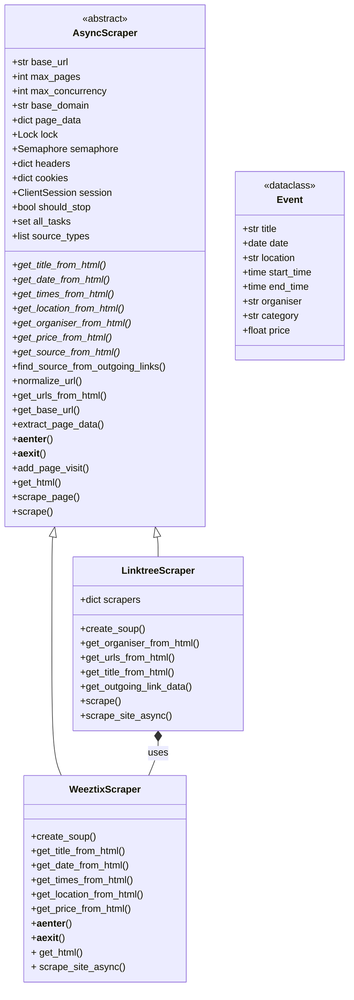

# Architecture

## Class structure

```mermaid
classDiagram
    AsyncScraper <|-- WeeztixScraper
    AsyncScraper <|-- LinktreeScraper
    
class AsyncScraper {
    <<abstract>> 
    +str base_url
    +int max_pages
    +int max_concurrency
    +str base_domain
    +dict page_data
    +Lock lock
    +Semaphore semaphore
    +dict headers
    +dict cookies
    +ClientSession session
    +bool should_stop
    +set all_tasks
    +list source_types
    }
    AsyncScraper: +get_title_from_html()*
    AsyncScraper: +get_date_from_html()*
    AsyncScraper: +get_times_from_html()*
    AsyncScraper: +get_location_from_html()*
    AsyncScraper: +get_organiser_from_html()*
    AsyncScraper: +get_price_from_html()*
    AsyncScraper: +get_source_from_html()*
    AsyncScraper: +find_source_from_outgoing_links()
    AsyncScraper: +normalize_url()
    AsyncScraper: +get_urls_from_html()
    AsyncScraper: +get_base_url()
    AsyncScraper: +extract_page_data()
    AsyncScraper: +__aenter__()
    AsyncScraper: +__aexit__()
    AsyncScraper: +add_page_visit()
    AsyncScraper: +get_html()
    AsyncScraper: +scrape_page()
    AsyncScraper: +scrape()

class WeeztixScraper {
    }

    WeeztixScraper: +create_soup()
    WeeztixScraper: +get_title_from_html()
    WeeztixScraper: +get_date_from_html()
    WeeztixScraper: +get_times_from_html()
    WeeztixScraper: +get_location_from_html()
    WeeztixScraper: +get_price_from_html()
    WeeztixScraper: +__aenter__()
    WeeztixScraper: +__aexit__()
    WeeztixScraper: + get_html()
    WeeztixScraper: + scrape_site_async()

class LinktreeScraper {
        +dict scrapers
    }
    LinktreeScraper *-- WeeztixScraper : uses
    LinktreeScraper: +create_soup()
    LinktreeScraper: +get_organiser_from_html()
    LinktreeScraper: +get_urls_from_html()
    LinktreeScraper: +get_title_from_html()
    LinktreeScraper: +get_outgoing_link_data()
    LinktreeScraper: +scrape()
    LinktreeScraper: +scrape_site_async()

    class Event {
        <<dataclass>>
        +str title 
        +date date
        +str location
        +time start_time
        +time end_time
        +str organiser
        +str category
        +float price
    }
    
```